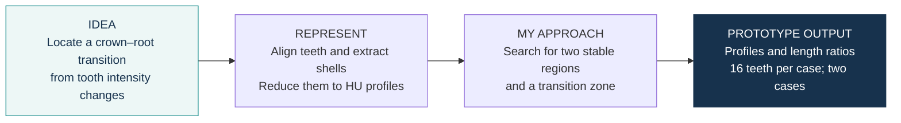

# Dental CEJ & crown–root morphometrics · prototype

**Idea:** explore whether changes in intensity along a tooth can help localize a
crown–root transition. **My approach:** align segmented teeth, measure HU in their
outer shells, and search the profiles for two stable regions and a transition zone.

## What the prototype produced

| Case | Teeth in saved table | Median ratio | Observed range |
|---|---:|---:|---:|
| Person1 | 16 | 0.6885 | 0.375–3.222 |
| Person2 | 16 | 0.8315 | 0.569–3.625 |

Ratios summarize the saved `dynamic_10_90` output column `crown_root_ratio_mm`.
Its numerator includes the transition zone. The chart shows all 16 teeth per case,
including large ratios. These are exploratory measurements; they are not reference
CEJ annotations or a diagnostic result.

## What I built

- Extracted outer-shell HU profiles after principal-axis alignment of segmented teeth.
- Compared shell thicknesses and implemented a profile-based three-zone search.
- Exported crown–root ratios and built interactive views for inspecting a tooth crop.

## Notebook map

| Notebook | Role |
|---|---|
| [CEJ1](notebooks/CEJ1.ipynb) / [CEJ2](notebooks/CEJ2.ipynb) | Shell profiles for Person1 / Person2 |
| [ratio1](notebooks/ratio1.ipynb) / [ratio2](notebooks/ratio2.ipynb) | Profile comparisons, zone search and ratio export |
| [Pulp](notebooks/Pulp.ipynb) | Single-tooth mask filling, cropping, PCA and interactive views |

**Data:** two CT cases with existing tooth masks. Raw scans and masks are not distributed;
the repository includes selected numerical profiles and ratio tables. [Input requirements](data/README.md).

## Explore the project

[Methods](docs/methodology.md) · [Data and provenance](docs/data-provenance.md) · [Saved tables](results/README.md) · [Viewing / chart rendering](docs/environment.md)

**Status:** exploratory prototype. Results shown here were saved during earlier experiments;
the notebooks were not rerun for this release. Figures were rendered from saved tables.

**Author:** [trungnb](https://github.com/trungnb) · [Academic website](https://trungnb.github.io/)

Research and educational use only; this prototype has not been clinically validated.
See [licensing status](LICENSE) before reuse.
