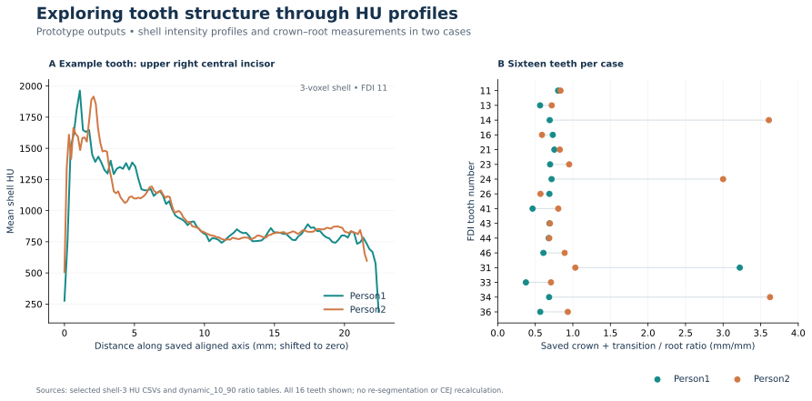

# Crown–root transition morphometrics · exploratory prototype

A two-case CT prototype exploring whether outer-shell tooth intensity profiles can identify an
**intensity-derived crown–root transition proxy**. It does **not** establish anatomical CEJ
localisation or validated crown–root morphometry.

## Prototype snapshot

| Case | n | Median ratio | Range |
|---|---:|---:|---:|
| Person1 | 16 | 0.6885 | 0.375–3.222 |
| Person2 | 16 | 0.8315 | 0.569–3.625 |

The saved ratio is crown + transition divided by root extent. Large ratios are retained as
prototype failure cases rather than removed; they are not reference CEJ measurements or
diagnostic results.

## How I approached it

The historical ratio notebooks use the three-voxel shell and search the central 10–90% of
the profile for two relatively stable regions separated by a transition. The method is
heuristic and was not calibrated against anatomical CEJ annotations.

## Read the code and results

- [Shell-profile notebooks](notebooks/CEJ1.ipynb) / [Person2](notebooks/CEJ2.ipynb)
- [Ratio notebooks](notebooks/ratio1.ipynb) / [Person2](notebooks/ratio2.ipynb)
- [Single-tooth exploration](notebooks/Pulp.ipynb)
- [Person1 ratios](results/ratios_person1.csv) / [Person2 ratios](results/ratios_person2.csv)
- [Example FDI 11 profiles](results/profiles/person1_fdi11_shell3.csv) / [Person2](results/profiles/person2_fdi11_shell3.csv)
- [Figure script](scripts/render_figures.py) · [Dependencies](requirements.txt)

## Scope and limitations

This repository preserves an early exploratory implementation, not a validated measurement
or diagnostic system.

- The transition is an intensity-derived proxy, not an anatomical CEJ reference.
- Historical PCA uses voxel-index coordinates; millimetre-labelled outputs are therefore
  exploratory, particularly with anisotropic spacing.
- Shell thickness is defined in voxels, and rotation/interpolation may affect intensity profiles.
- Search bounds and transition limits are hand-crafted prototype assumptions.
- Results come from two cases only; there is no manual CEJ reference, inter-rater assessment,
  external validation, or population-level performance estimate.

Historical notebooks and saved outputs were not rerun or retrospectively corrected for this
public release. Raw scans and tooth masks are not distributed.

## Intended next steps

A research-grade extension would represent geometry in physical coordinates or use isotropic
resampling, define shell thickness in millimetres, improve robust profile features, and validate
transition locations against independent anatomical CEJ annotations in a larger cohort.

[trungnb](https://github.com/trungnb) · [Academic website](https://trungnb.github.io/) · [Reuse status](LICENSE)

Provenance and file fingerprints

Packaged on 2026-09-28 from existing notebooks and saved result files. No segmentation,
model training, evaluation, or reproduction run was performed. Original notebook hashes
refer to local author backups that are not distributed; hashes identify the compared
files but do not establish reproducibility or the original input image version.

| Notebook | Original SHA-256 | Published SHA-256 |
|---|---|---|
| `notebooks/CEJ1.ipynb` | `d43d1665f79f1d0905ee67573cb076e2c98ded63eb8cd09d9d71512130539b25` | `7aed77227370a3608cc0777e2a668c3d17b3091c933fe503d2057419601261b9` |
| `notebooks/CEJ2.ipynb` | `811595a3af250d866f2d443378f7c48f1b3ddbdc8a92eb860119c665fde3b6fe` | `c6576b64d0cbc717bfbdd7a5227dbceda3514238e4967fc9232d8d7a1dfb52e3` |
| `notebooks/ratio1.ipynb` | `92ac488a00c0ef0b8ac16a948b2d393fae002c3c67c9e5fcb59cb3c575b862ff` | `8e580fae70898a6aa96fd2933a65533c559749c1c615766c7afcff6c3bb97f1c` |
| `notebooks/ratio2.ipynb` | `48562edc75067e6d391a058191ca1e981bba33112f75cc29a1bb6423cc81b8d2` | `e32bc1cff7c1c590b7482cef85d7fde749725d98fb8eea5d34cb20f883d142a3` |
| `notebooks/Pulp.ipynb` | `57954ea7e42979677fc451bf153a3ddb3f93fb80706ff49b21a5b9bfcd6814ba` | `6689f580bbc9966adeb940c60f8210311f68e9447cca6b6e979e84e2ffa42df5` |

The four profile and ratio source CSVs are existing saved files. `ratio_summary.csv` is a
descriptive aggregation of the saved `crown_root_ratio_mm` values. These hashes fingerprint
the published files; they do not identify image acquisition, execution date, hardware, or
analysis package versions.

| Published CSV | SHA-256 |
|---|---|
| `results/ratios_person1.csv` | `575692c2470dcf2cd0a63ac56cee91828d4cfd9774f5b0d2eac25a4b9acf470b` |
| `results/ratios_person2.csv` | `5ce19415ecca6e1edc576cfe4bb8d182d052808f36b08867d6cc78fd2b84da31` |
| `results/profiles/person1_fdi11_shell3.csv` | `01eab8532b5cdff6043ddc476e17a0780ce7d20f3558e68574762d51e75d859c` |
| `results/profiles/person2_fdi11_shell3.csv` | `2accc016a5838b2eba9af47b1aa18c14a5f4b1bbf84b80dab6db4712642090a0` |
| `results/ratio_summary.csv` | `3c0f4dc1e7ef332eb6c0c53fee7d69cbaedd0bff2ea3f5279edd88edc2117b5c` |

The overview SVG was rendered from the two FDI 11 profile CSVs and the two ratio CSVs by
`scripts/render_figures.py`. It shifts each saved `z_mm` profile to its own zero; it does
not run image processing or recalculate ratios. Raw CT scans, tooth masks, and local
backups are not published. Third-party packages and source datasets retain their terms.

