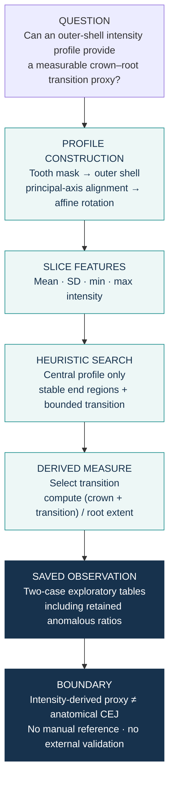

# Crown–root transition morphometrics · exploratory prototype

A two-case CT prototype exploring whether outer-shell tooth intensity profiles can identify an
**intensity-derived crown–root transition proxy**. It does **not** establish anatomical CEJ
localisation or validated crown–root morphometry.

## Prototype snapshot

| Case | n | Median ratio | Range |
|---|---:|---:|---:|
| Person1 | 16 | 0.6885 | 0.375–3.222 |
| Person2 | 16 | 0.8315 | 0.569–3.625 |

The saved ratio is crown + transition divided by root extent. Large ratios are retained as
prototype failure cases rather than removed; they are not reference CEJ measurements or
diagnostic results.

## How I approached it

The historical ratio notebooks use the three-voxel shell and search the central 10–90% of
the profile under minimum stable-region and tooth-group-specific transition-length constraints.
Exact rules remain in the notebooks. The method is heuristic and was not calibrated against
anatomical CEJ annotations.

**Reproducibility note:** the committed Person2 shell-3 profile used by the saved ratio analysis
is preserved in `results/`, while the current final execution cell in `CEJ2.ipynb` invokes a
five-voxel shell after the earlier 1–4 shell loop was commented out. The saved historical
result is therefore documented, but the current notebook is not a one-click regeneration of
that shell-3 input.

## Read the code and results

- [Shell-profile notebooks](notebooks/CEJ1.ipynb) / [Person2](notebooks/CEJ2.ipynb)
- [Ratio notebooks](notebooks/ratio1.ipynb) / [Person2](notebooks/ratio2.ipynb)
- [Person1 ratios](results/ratios_person1.csv) / [Person2 ratios](results/ratios_person2.csv)
- [Example FDI 11 profiles](results/profiles/person1_fdi11_shell3.csv) / [Person2](results/profiles/person2_fdi11_shell3.csv)
- [Figure script](scripts/render_figures.py)

## Scope and limitations

This repository preserves an early exploratory implementation, not a validated measurement
or diagnostic system.

- The transition is an intensity-derived proxy, not an anatomical CEJ reference.
- Historical PCA uses voxel-index coordinates; millimetre-labelled outputs are therefore
  exploratory, particularly with anisotropic spacing.
- Shell thickness is defined in voxels, and rotation/interpolation may affect intensity profiles.
- Search bounds and transition limits are hand-crafted prototype assumptions.
- Results come from two cases only; there is no manual CEJ reference, inter-rater assessment,
  external validation, or population-level performance estimate.

Historical notebooks and saved outputs were not rerun or retrospectively corrected for this
public release. Raw scans and tooth masks are not distributed.

## Intended next steps

A research-grade extension would represent geometry in physical coordinates or use isotropic
resampling, define shell thickness in millimetres, improve robust profile features, and validate
transition locations against independent anatomical CEJ annotations in a larger cohort.

[Academic website](https://trungnb.github.io/) · [Reuse status](LICENSE)
