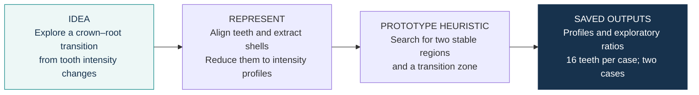
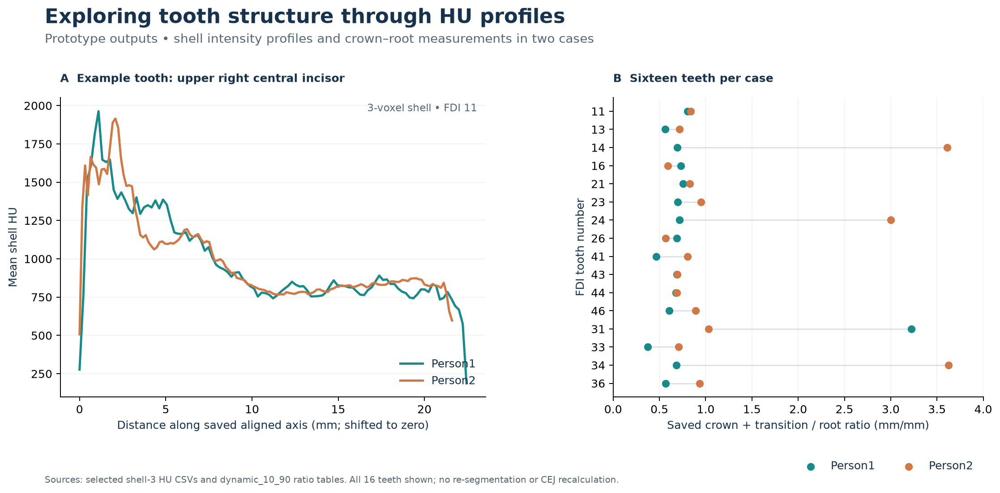

# Crown–root transition morphometrics · exploratory prototype

> **CEJ-oriented prototype:** this project explores an intensity-derived crown–root
> transition proxy. It does **not** establish anatomical CEJ localisation.

**Idea:** explore whether changes in intensity along a segmented tooth can identify a
crown–root transition. **My approach:** align segmented teeth, sample their outer-shell
intensity profiles, and search for two relatively stable regions separated by a transition zone.

## What the prototype produced

| Case | Teeth in saved table | Median ratio | Observed range |
|---|---:|---:|---:|
| Person1 | 16 | 0.6885 | 0.375–3.222 |
| Person2 | 16 | 0.8315 | 0.569–3.625 |

Ratios summarize the historical `dynamic_10_90` output column `crown_root_ratio_mm`.
Its numerator includes the transition zone. The chart shows all 16 teeth per case,
including large and anatomically implausible ratios. These values are retained as
prototype failure cases rather than filtered out. They are not reference CEJ annotations,
validated morphometric measurements, or diagnostic results.

## What I built

- Extracted outer-shell intensity profiles after principal-axis alignment of segmented teeth.
- Compared shell thicknesses and implemented a profile-based three-zone heuristic.
- Exported exploratory crown–root ratios and built interactive views for inspecting a tooth crop.

## Prototype limitations

This was an early exploratory implementation, preserved to show the development process rather
than a finished measurement method.

- The detected transition is an **intensity-derived proxy**, not a validated anatomical CEJ.
- The search uses hand-crafted assumptions, including the 10–90% search interval and
  tooth-type-specific transition limits.
- Historical PCA/alignment calculations operate in voxel-index space. The saved millimetre
  values use the original image spacing after rotation and therefore should not be interpreted
  as validated physical morphometry, particularly for anisotropic voxels.
- Shell thickness is defined in voxels rather than millimetres.
- Image rotation/interpolation may influence the intensity profiles.
- No manual CEJ reference, inter-rater comparison, external validation, or clinical validation
  was performed.

A future version would use physical/world coordinates or isotropic resampling, define shell
thickness in millimetres, use more robust profile features, and validate the transition against
independent anatomical reference annotations.

## Notebook map

| Notebook | Role |
|---|---|
| [CEJ1](notebooks/CEJ1.ipynb) / [CEJ2](notebooks/CEJ2.ipynb) | Historical shell-profile experiments for Person1 / Person2 |
| [ratio1](notebooks/ratio1.ipynb) / [ratio2](notebooks/ratio2.ipynb) | Profile comparisons, heuristic zone search and ratio export |
| [Pulp](notebooks/Pulp.ipynb) | Single-tooth mask filling, cropping, PCA and interactive views |

**Data:** two CT cases with existing tooth masks. Raw scans and masks are not distributed;
the repository includes selected numerical profiles and ratio tables. [Input requirements](data/README.md).

## Explore the project

[Methods](docs/methodology.md) · [Data and provenance](docs/data-provenance.md) · [Saved tables](results/README.md) · [Viewing / chart rendering](docs/environment.md)

**Status:** historical exploratory prototype. Results shown here were saved during earlier
experiments; the research notebooks were not rerun or retrospectively corrected for this
portfolio release. Figures were rendered from the saved tables.

**Author:** [trungnb](https://github.com/trungnb) · [Academic website](https://trungnb.github.io/)

Research and educational use only; this prototype has not been clinically validated.
See [licensing status](LICENSE) before reuse.
